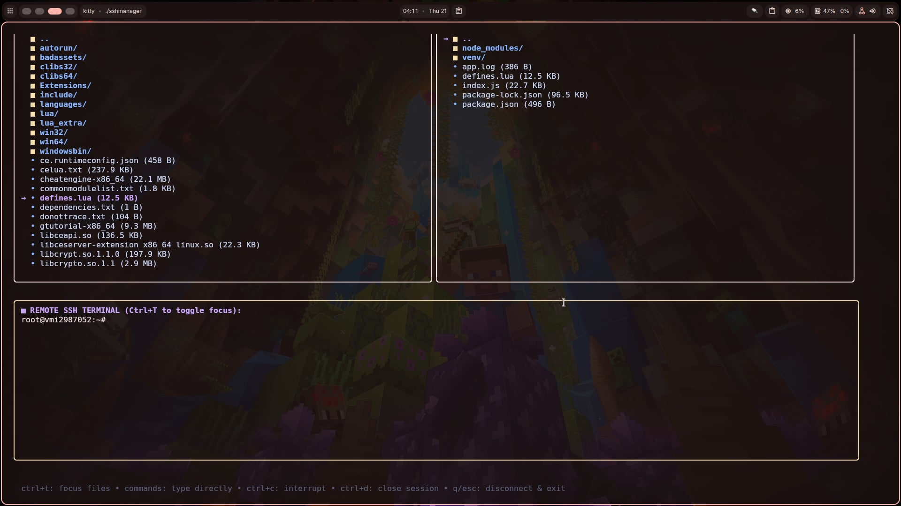
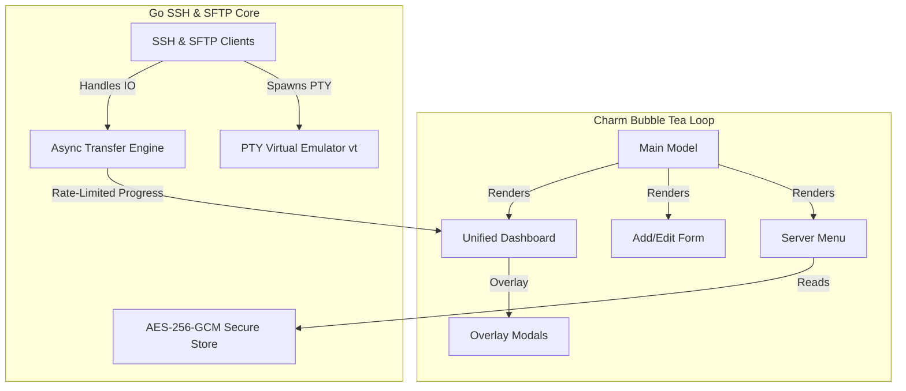

# ⚡ SSH & SFTP Manager TUI ⚡




A secure, blazing-fast, and beautiful **Terminal User Interface (TUI)** dashboard for managing SSH servers and transferring files via SFTP. Built using Go and the Charm Bracelet TUI framework (`bubbletea`, `lipgloss`, `bubbles`), it brings a modern visual workspace directly into your terminal.

---

## ✨ Key Features

*   **🔒 Secure Credentials Store**: Host credentials, usernames, and passwords are encrypted using **AES-256-GCM**. Encryption keys are generated locally with restricted `0600` permissions.
*   **🖥️ Dual-Pane SFTP File Browser**: A classic split-pane interface (Local on the left, Remote on the right) allowing seamless navigation, directory traversal, and operations.
*   **⚡ Integrated PTY Terminal**: Run a live, interactive SSH terminal pane below your file browser. Toggle focus on the fly using `Ctrl+T`.
*   **📐 Dynamic Panel Resizing**: Resize TUI layout ratios dynamically! Adjust file panel split widths and terminal height partition splits via intuitive hotkeys.
*   **🖱️ Mouse Interaction Support**: Click on panels directly to change focus, and use the scroll wheel to navigate file listings seamlessly.
*   **🎯 High-Visibility Block Cursor**: Features a custom, high-contrast, non-blinking block cursor inside the focused terminal panel to track input insertion points.
*   **📊 Centered Overlay Modals**: Progress bars, loader indicators, connection states, and safety confirmation prompts appear as elegant, centered modal dialogs.
*   **🔄 Robust Async File Transfers**: Upload/download files and entire directory structures asynchronously. Features recursive symlink handling, infinite loop safety, and global 100ms update rate-limiting to prevent TUI stuttering.
*   **🗑️ Integrated File Operations**: Delete files or folders safely on either the local filesystem or the remote server, backed by a confirmation prompt.
*   **🎯 Smart Project Auto-Focus**: Assign a local workspace directory to any server profile. Launching `sshmanager` from inside that directory automatically highlights the matching server.

---

## 📐 System Architecture

The following diagram illustrates how the TUI coordinates the asynchronous network layers, progress channels, and interactive terminal loops:



---

## 🚀 Installation & Setup

### Prerequisites
*   Go **1.26** or higher.
*   A terminal supporting standard ANSI escape codes.

### Build from Source
To compile the application and generate a local binary:
```bash
# Clone the repository
git clone https://github.com/xspoilt-dev/sshmanager.git
cd sshmanager

# Build the executable
go build -o sshmanager

# (Optional) Install globally in your system's Go bin directory
go install
```

---

## ⌨️ Keybindings Reference

### 1. Main Server Menu
| Key | Action |
|:---|:---|
| `↑` / `↓` or `k` / `j` | Navigate the server card list |
| `enter` / `c` / `u` | Connect to the selected server |
| `a` | Add a new server profile |
| `e` | Edit the selected server configuration |
| `d` / `backspace` | Delete the selected server profile (requires confirmation) |
| `q` / `Ctrl+C` | Quit the application |

### 2. Add / Edit Server Form
| Key | Action |
|:---|:---|
| `tab` / `↓` | Move cursor to the next field |
| `shift+tab` / `↑` | Move cursor to the previous field |
| `enter` | Save server configuration details |
| `esc` | Cancel changes and return to menu |

### 3. Unified Dashboard (File Panels & Terminal)
Toggle active panel focus between the **File Browser (Top)** and the **SSH Terminal (Bottom)** using **`Ctrl+T`**.

#### 📁 When File Panel is Focused:
| Key | Action |
|:---|:---|
| `tab` / `←` / `→` | Switch active panel between **Local (Left)** and **Remote (Right)** |
| `↑` / `↓` or `k` / `j` | Browse file and directory list |
| `+` / `-` / `[` / `]` | Resize file panel width partition splits |
| `ctrl+left arrow` / `ctrl+right arrow` | Resize file panel width partition splits |
| `ctrl+up arrow` / `ctrl+down arrow` | Adjust vertical split height (makes files panels taller/shorter) |
| `enter` | Open/Enter directory (or go up via `..` parent link) |
| `backspace` | Go up to parent directory |
| `u` | Upload selected item from Local to Remote |
| `d` | Download selected item from Remote to Local |
| `x` / `delete` | Permanently delete the selected file/folder (requires confirmation) |
| `q` / `esc` | Close session, disconnect client, and return to main menu |

#### 📟 When Terminal Panel is Focused:
| Key | Action |
|:---|:---|
| `Type directly` | Send keystrokes directly to the remote shell session |
| `ctrl+up arrow` / `ctrl+down arrow` | Adjust terminal split height (makes terminal taller/shorter) |
| `Ctrl+C` | Send interrupt signal (SIGINT) to the remote process |
| `Ctrl+D` | Close remote terminal session (EOF) |
| `Ctrl+T` | Toggle focus back to file panels |
| `q` / `esc` | Close connection and return to server menu |

---

## 🔒 Security Design

`sshmanager` values credential safety:
1.  **AES-256-GCM Encryption**: Server login parameters (host, port, username, password) are encrypted before writing to disk.
2.  **Unique Local Keyring**:
    *   On first run, the manager generates a cryptographic key stored at `~/.config/sshmanager/key.bin`.
    *   This file is written with strict Unix file permissions (`0600`), meaning only your local system user account has read/write privileges.
3.  **Local storage only**: No credentials ever touch external servers or cloud keyrings.

---

## 🤝 Contributing

Contributions, bug reports, and pull requests are welcome! 
1. Fork the Project.
2. Create your Feature Branch (`git checkout -b feature/AmazingFeature`).
3. Commit your Changes (`git commit -m 'Add some AmazingFeature'`).
4. Push to the Branch (`git push origin feature/AmazingFeature`).
5. Open a Pull Request.

---

